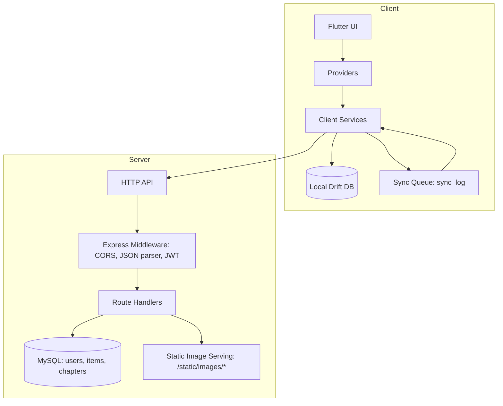

# Writer

Writer is an offline-first literature platform consisting of:

- a **Flutter client application** (`Flutter writer/writer`)
- a **Node.js/Express backend API** (`backend`)

The client supports reading and authoring workflows, while the backend provides authentication, literature/chapter persistence, and static image serving.

## Repositories

- **Frontend (Flutter):** https://github.com/OwaisShaikh1/Flutter-writer
- **Backend (Node.js/Express):** https://github.com/OwaisShaikh1/FlutterWriterBackend

## Tech Stack

### Frontend (Flutter App)

- **Framework:** Flutter
- **Language:** Dart
- **State Management:** Provider (`ChangeNotifier`)
- **Local Database:** Drift (SQLite)
- **Networking:** `http`
- **Connectivity:** `connectivity_plus`
- **Storage:** `flutter_secure_storage` (IO), `shared_preferences` (Web adapter)
- **Media & Content:** `image_picker`, `image_cropper`, `flutter_image_compress`, `cached_network_image`, `flutter_markdown`, `markdown_toolbar`
- **File Export:** `file_picker`

### Backend (API Server)

- **Runtime:** Node.js
- **Framework:** Express (`5.1.0`)
- **Database:** MySQL (`mysql2`)
- **Authentication:** JWT (`jsonwebtoken`)
- **Password Hashing:** `bcryptjs`
- **Middleware:** `cors`, `body-parser`
- **Config:** `dotenv`
- **Optional dependency in backend package:** `mongoose`

## System Overview

The platform provides:

- account registration/login with JWT-based authentication
- literature item creation, editing, deletion, and listing
- chapter creation, replacement, and retrieval
- cover image serving from backend static paths
- client-side offline writes with queued synchronization
- markdown-based chapter drafting and reading
- profile/library/interaction UI flows on the client

## End-to-End Architecture



## Repository Structure

```text
SEM6MadLab/
  Flutter writer/
    writer/
      lib/
      test/
  backend/
    index1.js
    package.json
    static/images/
```

## Frontend Architecture (Client)

Core layers:

- **Pages/Widgets:** dashboards, auth screens, reader, manuscript creation/editing, profile/settings
- **Providers:** `AuthProvider`, `LiteratureProvider`, `SyncProvider`, `ThemeProvider`
- **Services:** `AuthService`, `ApiService`, `SyncService`, `OfflineSyncService`, `StorageService`, export/image adapters
- **Local Persistence:** Drift tables for `users`, `items`, `chapters`, `comments`, `user_activity`, `sync_log`

Offline-first behavior:

- write to local database first
- queue sync operations in `sync_log`
- process queue when connectivity is restored

## Backend Architecture (Server)

The backend exposes:

- authentication routes: `/register`, `/login`, `/verify-token`
- literature routes: `/items`, `/items/:id`, `/my-items`
- chapter routes: `/chapters`, `/chapters/:itemId`
- utility routes: `/users`, `/sync-images`, `/`
- static image route: `/static/images/*`

Access model:

- public read routes for browsing content
- protected routes requiring JWT
- ownership checks for modifying/deleting authored content

## Data Model Alignment

### Backend (MySQL)

- `users`: account identity and credentials (hashed password)
- `items`: literature metadata and author linkage
- `chapters`: chapter content by item

### Frontend (Drift SQLite)

- mirrors content with local-first semantics
- includes additional sync metadata (`serverId`, `isSynced`, `hasChanged`, retries)
- tracks pending operations via `sync_log`

This dual-model setup enables offline editing while preserving backend source-of-truth synchronization.

## API Summary (Documented Backend)

| Method | Endpoint | Auth | Purpose |
|---|---|---|---|
| GET | `/` | No | Health check |
| POST | `/register` | No | Register user |
| POST | `/login` | No | Login user |
| POST | `/verify-token` | Yes | Validate JWT |
| GET | `/users` | Yes | List usernames |
| GET | `/items` | No | List literature items |
| POST | `/items` | Yes | Create item |
| PUT | `/items/:id` | Yes + Owner | Update item |
| DELETE | `/items/:id` | Yes + Owner | Delete item |
| GET | `/my-items` | Yes | List current user's items |
| GET | `/chapters` | No | Fetch chapters by `bookId` |
| POST | `/chapters` | Yes | Create chapters |
| PUT | `/chapters/:itemId` | Yes + Owner | Replace chapters |
| POST | `/sync-images` | No | Match image files to items |
| GET | `/static/images/*` | No | Serve image assets |

## Integration Scope

- Core backend coverage includes authentication, items, chapters, image sync, and static image serving.
- The frontend codebase includes additional profile/social/upload integrations (for example profile, follow, comments, likes, ratings, and image upload routes).
- API feature parity should be validated during deployment based on the active backend version.

## Security Model

Implemented backend security characteristics:

- bcrypt password hashing
- JWT authentication with expiry
- ownership validation for protected modifications
- CORS middleware enabled
- prepared/parameterized query approach

## Setup

### Frontend

From `Flutter writer/writer`:

```bash
flutter pub get
flutter run
flutter test
flutter analyze
```

### Backend

From `backend`:

```bash
npm install
node index1.js
```

Backend default runtime behavior in documentation:

- binds on port `5000` by default
- supports `PORT` override
- requires MySQL connection settings and JWT secret via environment variables

## Configuration Notes

- Set the client API URL in the app settings screen (server section).
- Ensure frontend base URL points to the backend host and port.
- For production, configure HTTPS, restricted CORS origins, and secure environment variables.

## Related Documentation

- Backend reference: `backend/backendReadme.md`
- Client sync design: `Flutter writer/writer/SYNC_LOGIC_DOCUMENTATION.md`
- Client web migration notes: `Flutter writer/writer/WEB_MIGRATION_FILE_BY_FILE.md`
